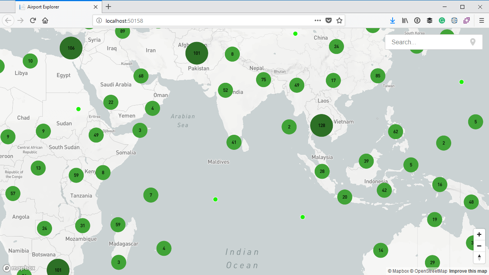
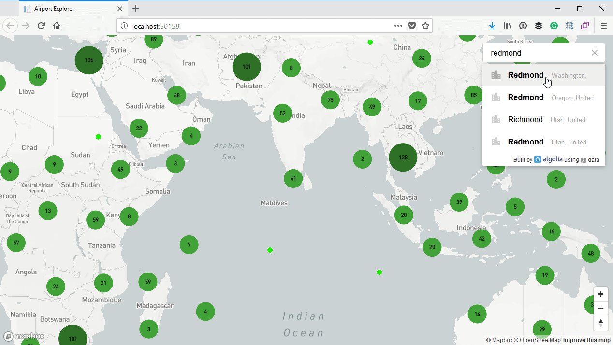
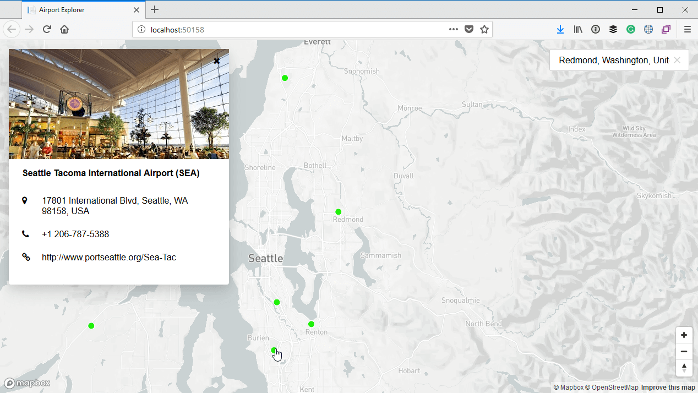

# Introduction

Microsoft provides [very good technical documentation](https://docs.microsoft.com/en-us/aspnet/core/) for ASP.NET Core. They also provide sevaral [tutorials](https://docs.microsoft.com/en-us/aspnet/core/tutorials/) demonstrating how to build a fairly basic application.

There are also many books and courses that will teach you ASP.NET Core. Along with the Microsoft provided tutorials, most of these courses seem to be centred around developing some sort of simple CRUD (Create, read, update and delete) application. In other words, they will teach you how to create an application which displays a list of items on a page, add new items to the list, view existing items, as well as update and delete items. Typically these applications are also backed by some form of database in which aforemetioned items will be stored.

But that is **NOT** what you will learn in this book.

I have nothing against developing CRUD applications. I think it is a very good starting point and after all, most applications need to store information in a database. But I think there are many skills you require which fall outside the scope of a typical CRUD application. Skills like getting information from other sources, such as files, 3rd party APIs, etc.

I also think there are more interesting ways in which to present information than simply listing items in a grid. Displaying it on a map, for example, is much more interesting. And fun.

So that is what this book is about. To be sure, this is also a very simple application we will be building. But it will be a different kind of simple application than what the typical tutorials demonstrate. And you will learn a very different set of skills and techniques.

## What you will build

The basic premise of the application we will build is that it allow users to explore the various airports around the world on a map. 

A user can zoom and pan the map or navigate to a particular city using a search box.

A user can also select any airport to view more information about it.

Sounds simple (and it is), but there are some interesting things happening under the hood and you will almost certainly be introduced to new techniques which you can apply in your own applications.

## What you will learn

Let me start off by saying that this book is **NOT** for people just starting off with programming in ASP.NET Core and C#.

This book assumes that you already have a basic understanding of ASP.NET Core and C#. It also assumes that you can build a basic application using either Visual Studio, or the .NET Core command line tools along with a code editor such as Visual Studio Code.

In the course of this book, you will be learning the following:

* Building a very simple, one page ASP.NET Razor Pages application.
* Using AJAX requests in an ASP.NET Razor Pages application.
* Using MapBox (https://www.mapbox.com/) to display a map and add markers to the map
* Handling a large amount of markers on a map using clusters.
* Reading information from a CSV file.
* Using GeoJSON to represent geographical information.
* Using 3rd party APIs such as Google Places to augment airport information.
* Using Algolia Places (https://community.algolia.com/places/) to add a location search autocomplete texbox to the map, and zooming the user to a selected location.
* Determining the current location of a user from their IP address.
* Using the Tailwind CSS framework (https://tailwindcss.com/) to style HTML.
* Probably some more cool things I cannot think of right now... 😉

Does this sound like fun to you? If so, then let's dig in!
