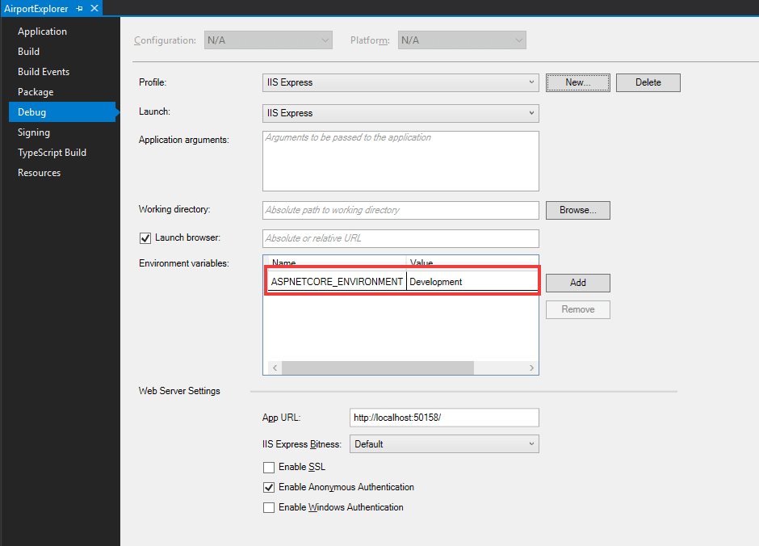
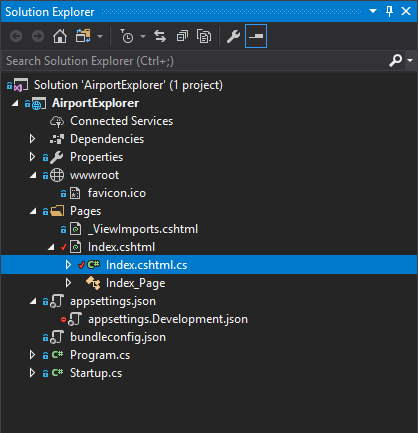

# Loading values from a configuration file

The code snippet from Mapbox which we included in our page contains the Mapbox **access token**. This access token is used by Mapbox to associate any API request being made to Mapbox - in this case by the JavaScript SDK - to your Mapbox account. 

Since this access token will be visible in the HTML being rendered in the user's browser, it is not really a secret since anyone can view the source of the web page and discover the value of your access token.

We will however want to store this value in a configuration file. One of the reasons is that it allows us to specify the value once. This means if we need to reference this value multiple places in our source code, we can simply change it once in the configuration file, instead of having to replace it multiple times in our source code.

ASP.NET Core includes a [configuration system](https://docs.microsoft.com/en-us/aspnet/core/fundamentals/configuration) which allows us to store and read values from external sources. The Razor Pages template we used to create our project already included configuration files named `appsettings.json` and `appsettings.Development.json`.

By default ASP.NET Core will load the values from the `appsettings.json` file. It will also load the values from the configuration file related to your [current environment](https://docs.microsoft.com/en-us/aspnet/core/fundamentals/environments). 

The current environment is set to **Development** because this is what is specified as the value of the `ASPNETCORE_ENVIRONMENT` environment variable of our application's properties:



ASP.NET Core will therefore also load the values from the `appsettings.Development.json` file. If your environment was set to **Production**, it would have attempted to load the values from the `appsettings.Production.json` file.

Let's add a **Mapbox** object to `appsettings.Development.json` with an **AccessToken** member with the value of the access token:

```json
{
  "Logging": {
    "IncludeScopes": false,
    "LogLevel": {
      "Default": "Debug",
      "System": "Information",
      "Microsoft": "Information"
    }
  },
  "Mapbox": {
    "AccessToken": "pk.eyJ1IjoiamVycmllcGVsc2VyIiwiYSI6ImNqYWJzZGthNDAyeDQzM29pYTFoY3hvYWoifQ.1oV15V4Q4r-RrSw-vU7JkA"
  }
}
```

## Reading the configuration values

ASP.NET Core allows us to access built-in framework services such as the configuration service by making use of [dependency injection](https://docs.microsoft.com/en-us/aspnet/core/fundamentals/dependency-injection). We do this by specifying a dependency on the configuration service (more specifically the `IConfiguration` class) in the constructor for our page.

You will find source code for your Razor Page in the code-behind file named `Index.cshtml.cs`. You may need to expand the `Index.cshtml` node in the **Solution Explorer** treeview to see this file:



Right now this file will have the following contents:

```csharp
using Microsoft.AspNetCore.Mvc.RazorPages;
using Microsoft.Extensions.Configuration;

namespace AirportExplorer.Pages
{
    public class IndexModel : PageModel
    {
        public void OnGet()
        {

        }
    }
}
```

We will need to add a constructor with a `configuration` parameter of type `IConfiguration`. At runtime the dependency injection system will inject an instance of `IConfiguration` which we can then use to read values from the configuration.

To read values from the `configuration` object, we can use an [indexer](https://docs.microsoft.com/en-us/dotnet/csharp/programming-guide/indexers/using-indexers) and specify the key of the configuration value we want to read. So for example, if we wanted to read a configuration value with the key `secret`, we could write the following code:

```csharp
string secret = configuration["secret"];
```

Because we specified the configuration values in our `appsettings.Development.json` in a hierarchical structure, we can use a colon (the `:` character) to delimit the different tree nodes when specifying the key we want to read. So to read the Mapbox access token we specified before we can use `Mapbox:AccessToken` as the key.

This is what the code for our `IndexModel` class looks like once we are done:

```csharp
using Microsoft.AspNetCore.Mvc.RazorPages;
using Microsoft.Extensions.Configuration;

namespace AirportExplorer.Pages
{
    public class IndexModel : PageModel
    {
        public string MapboxAccessToken { get; }

        public IndexModel(IConfiguration configuration)
        {
            MapboxAccessToken = configuration["Mapbox:AccessToken"];
        }

        public void OnGet()
        {

        }
    }
}
```

Notice that we specified a `MapboxAccessToken` property on the `IndexModel` class in which we store the value we read from the configuration. We can now use the property directly from our page model. Update the `Index.cshtml` as follows:

```html
@page
@model IndexModel

<!DOCTYPE html>
<html>
<head>
    <!-- some code omitted -->
</head>
<body>
<div id='map'></div>

<script src='https://api.mapbox.com/mapbox-gl-js/v0.42.0/mapbox-gl.js'></script>
<script>
    mapboxgl.accessToken = '@Model.MapboxAccessToken';
    var map = new mapboxgl.Map({
        container: 'map',
        style: 'mapbox://styles/mapbox/light-v9'
    });
</script>
</body>
</html>
```

Notice the call to `@Model.MapboxAccessToken`, which read the value of the Mapbox access token from the `MapboxAccessToken` property on the page model.

> Learn more
> 
> * [Working with multiple environments](https://docs.microsoft.com/en-us/aspnet/core/fundamentals/environments)
> * [Configure an ASP.NET Core Application](https://docs.microsoft.com/en-us/aspnet/core/fundamentals/configuration)
> * [Exploring Program.cs, Startup.cs and CreateDefaultBuilder in ASP.NET Core 2 preview 1](Exploring Program.cs, Startup.cs and CreateDefaultBuilder in ASP.NET Core 2 preview 1)
> * [Using Indexers in C#](https://docs.microsoft.com/en-us/dotnet/csharp/programming-guide/indexers/using-indexers)