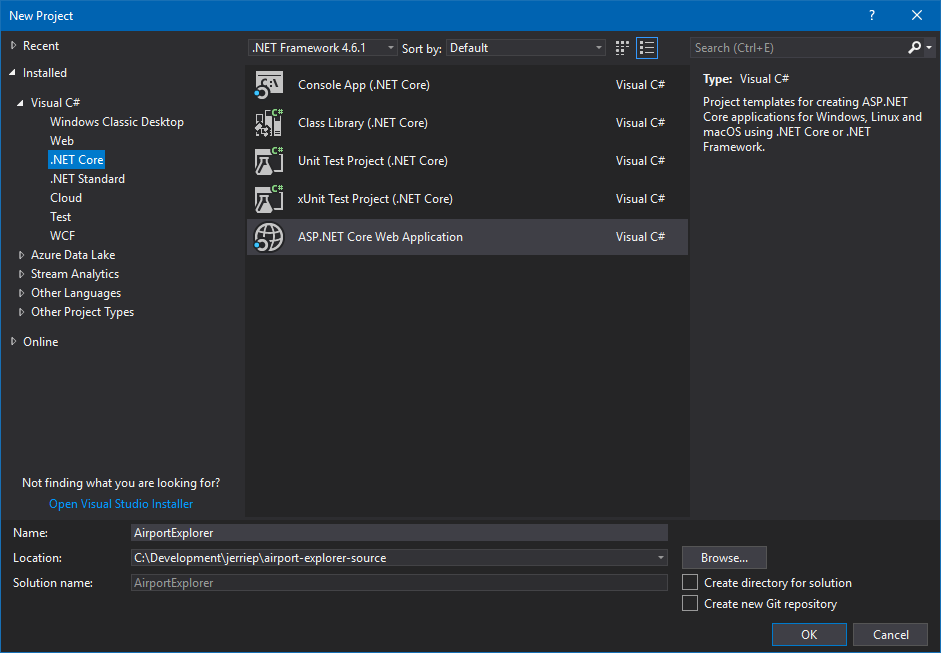
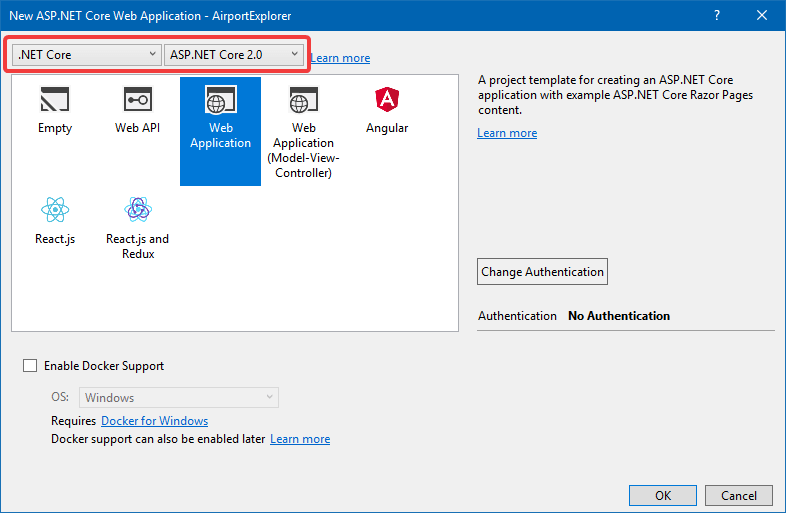
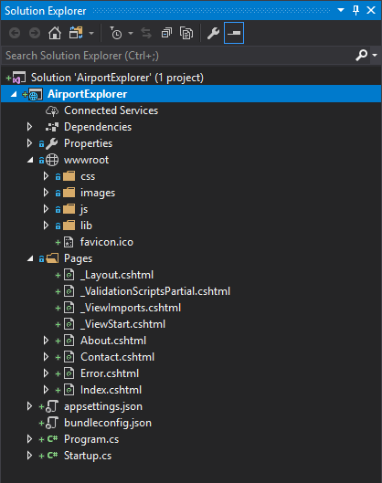
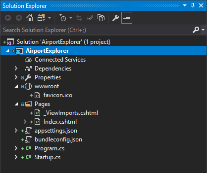
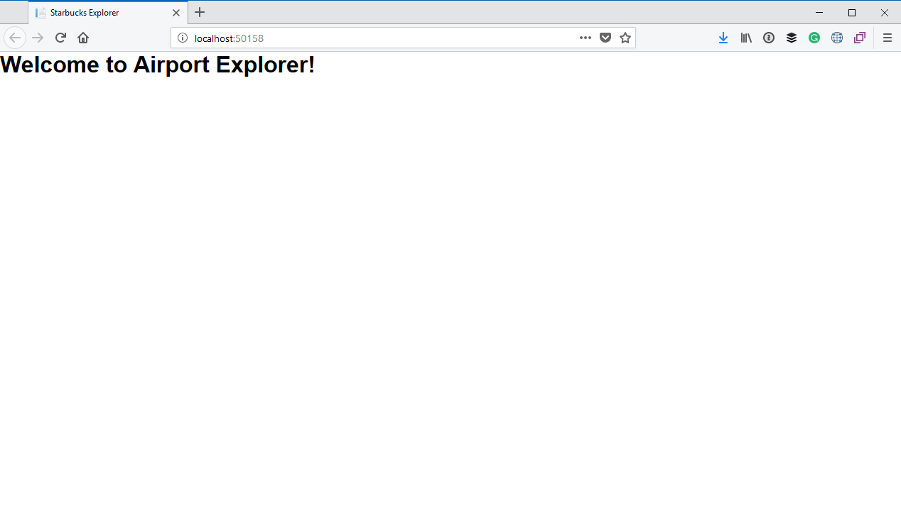

# Creating a Razor Pages Application

## Quick Razor Pages Intro

We will be using [ASP.NET Razor Pages](https://docs.microsoft.com/en-us/aspnet/core/mvc/razor-pages/) to build the application. Razor Pages was added in ASP.NET Core 2.0 with the aim of simplifying developing simple web pages with some code behind them. 

With ASP.NET MVC you would create a _Controller_ with _Actions_, and then create _Views_ which can be returned but those actions. These files would live across multiple folders. 

With Razor Pages, however, your _HTML markup_ for a page and a _C# "code-behind" file_ for that page that live together in a directory next to each other. Many developers believe that this makes things a bit more organized and easier to find your way around a project.

Because of this simpler programming model and because our application will consist of a single page, I will be using Razor pages. There are also a few tricks I want to highlight in terms of Razor pages, such as defining multiple _handlers_ for a page.

> For more information on Razor Pages I suggest reading [Introduction to Razor Pages in ASP.NET Core](https://docs.microsoft.com/en-us/aspnet/core/mvc/razor-pages/) and work through the [Getting started with Razor Pages in ASP.NET Core tutorial](https://docs.microsoft.com/en-us/aspnet/core/tutorials/razor-pages/razor-pages-start).

## Create a New Razor Pages Project

To create the new project you can go to** File > New > Project**. Under the **Visual C# > .NET Core** node, select **ASP.NET Core Web Application**. Give the application a name of **AirportExplorer** and select the location where you want to save the application.



On the next screen, ensure that you have selected **.NET Core** and **ASP.NET Core 2.0** in the two dropdowns at the top. The select **Web Application**, ensure that you have specified **No Authentication** and do not enabled Docker Support. Click **OK**.



> If you are using the .NET Core CLI you can use the `dotnet new razor` command to create a project using the sample template.

## Clean Up the Project

If you look at the project in Solution Explorer, you will notice that the project template added a bunch of CSS, Images and JavaScript in the **wwwroot** folder, as well as Index, About, Contact and Error pages.



A lot of this is not needed for our simple, one page application, so go ahead and get rid of the `css`, `images`, `js` and `lib` folders. Also get rid of the `_Layout.cshtml`, `_ValidationScriptsPartial.cshtml`, `_ViewStart.cshtml`, `About.cshtml`, `Contact.cshtml` and `Error.cshtml` files. These last three files will also contain code-behind files (for example `About.cshtml` will also have a code-behind file named `About.cshtml.cs`), so be sure to delete those as well.

Once you are done, this is what the project will look like:



Open the `Index.cshtml` file, and replace all of the markup in the file with the following:

```html
@page
@model IndexModel

<!DOCTYPE html>
<html>
<head>
    <meta charset='utf-8' />
    <title>Starbucks Explorer</title>
    <meta name='viewport' content='initial-scale=1,maximum-scale=1,user-scalable=no' />
    <link href='https://api.tiles.mapbox.com/mapbox-gl-js/v0.39.1/mapbox-gl.css' rel='stylesheet' />
    <link href="https://cdn.jsdelivr.net/npm/tailwindcss/dist/tailwind.min.css" rel="stylesheet">
    <link rel="stylesheet" href="https://maxcdn.bootstrapcdn.com/font-awesome/4.7.0/css/font-awesome.min.css" />
</head>
<body>
    <h1>Welcome to Airport Explorer!</h1>
</body>
</html>
```

At this point we should have a working application. You can run the application by going to the **Debug** menu and selecting **Start Without Debugging** (or by pressing **Ctrl-F5**). The application should open in your browser:



Not much to show at this stage, but at least we have a working application after stripping out so many pieces. Next we will display the Map, but before we can do that we will need to create a MapBox account.