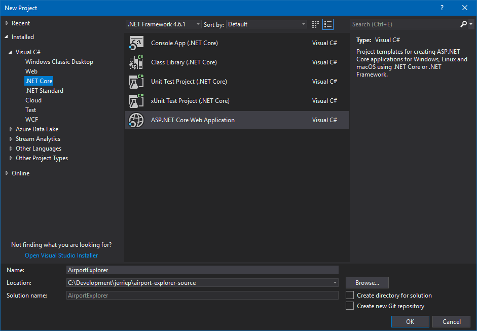
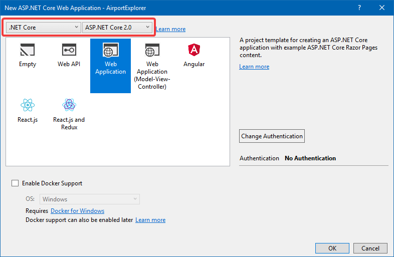
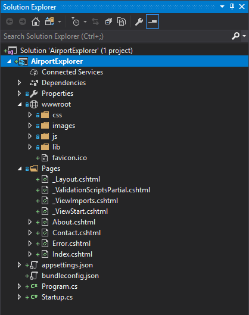
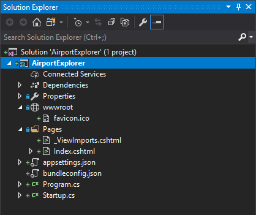
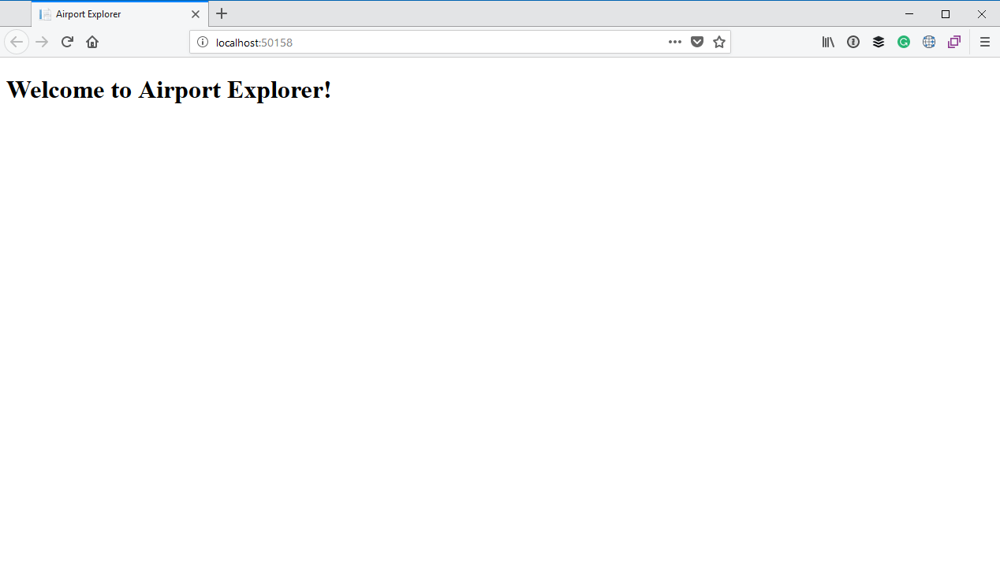

# ASP.NET Razor Pages

We will be using [ASP.NET Razor Pages](https://docs.microsoft.com/en-us/aspnet/core/mvc/razor-pages/) to build the application. Razor Pages was added in ASP.NET Core 2.0 with the aim of simplifying developing simple web pages with some code behind them. 

With ASP.NET MVC you would create a _Controller_ with _Actions_, and then create _Views_ which can be returned but those actions. These files would live across multiple folders. 

With Razor Pages, however, your _HTML markup_ for a page and a _C# "code-behind" file_ for that page live together in a directory next to each other. Many developers believe that this makes things a bit more organized and easier to find your way around a project.

Because of this simpler programming model and because our application will consist of a single page, I will be using Razor pages. There are also a few tricks I want to highlight in terms of Razor pages, such as defining multiple _handlers_ and _custom routing_ for a page.

I will not be going into too much of the technical details of Razor Pages, so I suggest reading [Introduction to Razor Pages in ASP.NET Core](https://docs.microsoft.com/en-us/aspnet/core/mvc/razor-pages/) and perhaps work through the [Getting started with Razor Pages in ASP.NET Core tutorial](https://docs.microsoft.com/en-us/aspnet/core/tutorials/razor-pages/razor-pages-start) if you are unfamiliar with it.


## Creating a new Razor Pages project

To create the new project you can go to the **File** menu and select **New > Project**. Under the **Visual C# > .NET Core** node, select **ASP.NET Core Web Application**. Give the application a name of **AirportExplorer** and select the location where you want to save the application.



On the next screen, ensure that you have selected **.NET Core** and **ASP.NET Core 2.0** in the two dropdowns at the top. The select **Web Application**, ensure that you have specified **No Authentication** and do not enable Docker Support. Click **OK**.



> If you are using the .NET Core CLI you can use the `dotnet new razor` command to create a project using the sample template.

## Clean up the project

If you look at the project in Solution Explorer, you will notice that the project template added a bunch of CSS, Images and JavaScript in the `wwwroot` folder, as well as Index, About, Contact and Error pages (along with some other files) inside a `Pages` folder.



A lot of the files created by the project template is not needed for our simple, one page application. First off, the folders under the `wwwroot` folder contains CSS stylesheets, sample images and external JavaScript libraries such as jQuery. We will be referencing CSS stylesheets from a CDN ([Content Delivery Network](https://en.wikipedia.org/wiki/Content_delivery_network)) and we will be using plain JavaScript in the application instead of jQuery. This means we can get rid of basically everything in the `wwwroot` folder, so go ahead and delete the `css`, `images`, `js` and `lib` folders. 

The `_Layout.cshtml` file is the [Layout file](https://docs.microsoft.com/en-us/aspnet/core/mvc/views/layout) being used for our application. Layout files are useful to ensure that you have consistent styling and layout across all the pages in your application. Since we will have just one page in the app there is no need for a shared layout file, so go ahead and delete the `_Layout.cshtml` file.

The `_ValidationScriptsPartial.cshtml` is a [partial view](https://docs.microsoft.com/en-us/aspnet/core/mvc/views/partial) which renders the jQuery validation scripts. Since we deleted all those scripts, you can go ahead and delete this file as well.

The `_ViewStart.cshtml` file is a special file which allows you to execute code before every view is rendered. Currently it specifies the default layout file to used for each view, but since we deleted the layout file, this is not required anymore. You can go ahead and delete this file as well.

Lastly there are three extra Razor Pages named `About.cshtml`, `Contact.cshtml` and `Error.cshtml` which are used for the About, Contact and Error pages. Since our application will be a simple one-pager, we only need the **Index** page. You can therefore go ahead and delete the `About.cshtml`, `Contact.cshtml` and `Error.cshtml` files. Each of these files also contain code-behind files (for example `About.cshtml` will have a code-behind file named `About.cshtml.cs`), so be sure to delete those as well.

Once you are done, this is what the project will look like:



## Fix up the Index page

Currently the Index page contains a whole lot of unnecessary HTML markup. It also depended on the Layout file to render the basic HTML page layout, but since we deleted the Layout file we need to fix up this page. Open the `Index.cshtml` file, and replace the contents of this file with the following:

```html
@page
@model IndexModel

<!DOCTYPE html>
<html>
<head>
    <meta charset='utf-8' />
    <title>Airport Explorer</title>
    <meta name='viewport' content='initial-scale=1,maximum-scale=1,user-scalable=no' />
</head>
<body>
<h1>Welcome to Airport Explorer!</h1>
</body>
</html>
```

It will render a very simple HTML page with the heading "Welcome to Airport Explorer!".

At this point we should have a working application. You can run the application by going to the **Debug** menu and selecting **Start Without Debugging** or by pressing **Ctrl-F5**. The application should open in your default web browser:



Not much to show at this stage, but at least we have a working application after stripping out so many pieces. Next we want to display the map, but before we can do that we will need to create a MapBox account.