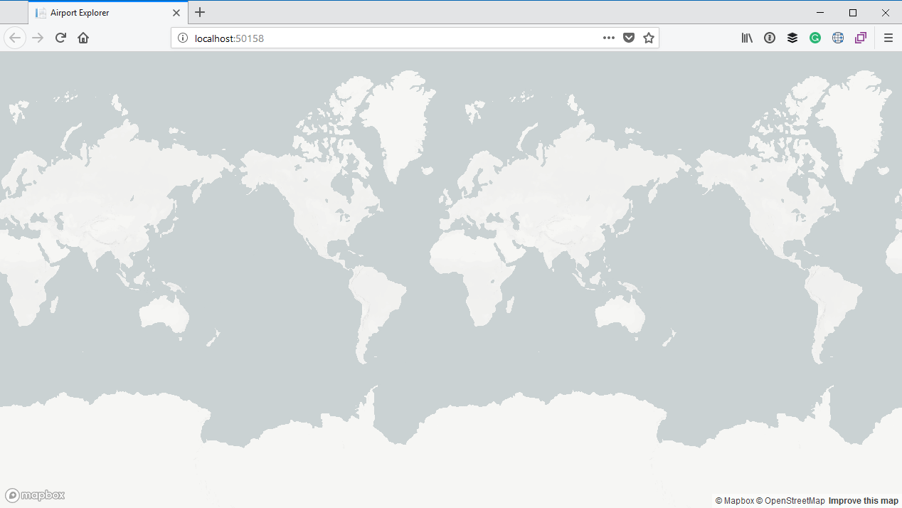

# Displaying the map

## Creating a Mapbox account

MapBox is a service which allows you to embed maps in your application. It is very similar to using Google Maps, but I prefer it due to its easier to use API.

The first thing we need to do is to create a MapBox account which you can do by going to https://www.mapbox.com/signup/. Go ahead and complete the sign up form by specifying a username, email address and password:


Next, you will be taken through the onboarding process. Select **Web** as the SDK you want to use:


On the next screen, choose to **Use the Mapbox CDN**:


Mapbox will now present you with a small code snippet with the JavaScript and CSS we can include in our application:


You can go ahead an update the HTML in your `Index.cshtml` file to include the reference to the CSS file in the `<head>` section, and the reference to the JavaScript file just before the closing `</body>` tag:

```html
@page
@model IndexModel

<!DOCTYPE html>
<html>
<head>
    <meta charset='utf-8' />
    <title>Airport Explorer</title>
    <meta name='viewport' content='initial-scale=1,maximum-scale=1,user-scalable=no' />
    <link href='https://api.mapbox.com/mapbox-gl-js/v0.42.0/mapbox-gl.css' rel='stylesheet' />
</head>
<body>
<h1>Welcome to Airport Explorer!</h1>

<script src='https://api.mapbox.com/mapbox-gl-js/v0.42.0/mapbox-gl.js'></script>
</body>
</html>
```

Heading back to the Mapbox website you can click on the **Next** button. This will present you with a screen where you can select the style of map you want. I will go with **Mapbox Light**, but if one of the other styles is more to your liking, then go ahead and select that. You can always change this later.


After selecting the style of map, you will notice that below the style selection there will be a code snippet once again which you can include in your application:


Replace the `<h1>` tag we added before with the `<div id='map'...` tag, and put the entire `script` section just before the closing `</body>` tag again. Make sure that this `<script>` block is added after the `<script>` which references the Mapbox JavaScript file.

Once you are done, your HTML should look something like the following:

```html
@page
@model IndexModel

<!DOCTYPE html>
<html>
<head>
    <meta charset='utf-8'/>
    <title>Airport Explorer</title>
    <meta name='viewport' content='initial-scale=1,maximum-scale=1,user-scalable=no'/>
    <link href='https://api.mapbox.com/mapbox-gl-js/v0.42.0/mapbox-gl.css' rel='stylesheet'/>
</head>
<body>
<div id='map' style='width: 400px; height: 300px;'></div>

<script src='https://api.mapbox.com/mapbox-gl-js/v0.42.0/mapbox-gl.js'></script>
<script>
    mapboxgl.accessToken = 'pk.eyJ1IjoiamVycmllcGVsc2VyIiwiYSI6ImNqYWJzZGthNDAyeDQzM29pYTFoY3hvYWoifQ.1oV15V4Q4r-RrSw-vU7JkA';
    var map = new mapboxgl.Map({
        container: 'map',
        style: 'mapbox://styles/mapbox/light-v9'
    });
</script>
</body>
</html>
```

> If you copy the code snippet above, please ensure that you replace the access token with the value of your own access token.

You can go back to the Mapbox website and close it, or click on the **Next** button and explore a bit more of what is possible with Mapbox at your own leisure.

## Running the application

Let's run the application again:


You will notice that we have a small map in the top left corner, but it would be better to have the map fill the entire screen. For that we will include an internal CSS stylesheet in the page. Add the following snippet in the `<head>` section just before the closing `</head>` tag:

```html
<style>
    body { margin:0; padding:0; }
    #map { position:absolute; top:0; bottom:0; width:100%; }
</style>
```

Also remove the `style` attribute from the `<div id='map'...` tag. Once done, this is what the HTML markup of your page should look like:

```html
@page
@model IndexModel

<!DOCTYPE html>
<html>
<head>
    <meta charset='utf-8'/>
    <title>Airport Explorer</title>
    <meta name='viewport' content='initial-scale=1,maximum-scale=1,user-scalable=no'/>
    <link href='https://api.mapbox.com/mapbox-gl-js/v0.42.0/mapbox-gl.css' rel='stylesheet'/>
    <style>
        body { margin:0; padding:0; }
        #map { position:absolute; top:0; bottom:0; width:100%; }
    </style>
</head>
<body>
<div id='map'></div>

<script src='https://api.mapbox.com/mapbox-gl-js/v0.42.0/mapbox-gl.js'></script>
<script>
    mapboxgl.accessToken ='pk.eyJ1IjoiamVycmllcGVsc2VyIiwiYSI6ImNqYWJzZGthNDAyeDQzM29pYTFoY3hvYWoifQ.1oV15V4Q4r-RrSw-vU7JkA';
    var map = new mapboxgl.Map({
        container: 'map',
        style: 'mapbox://styles/mapbox/light-v9'
    });
</script>
</body>
</html>
```

Now, when we run the application again, you will notice that we have a map that fills the entire web page:




**Learn more**

* [The difference between external style sheets, internal style sheets and inline style](https://www.w3schools.com/CSS/css_howto.asp)


