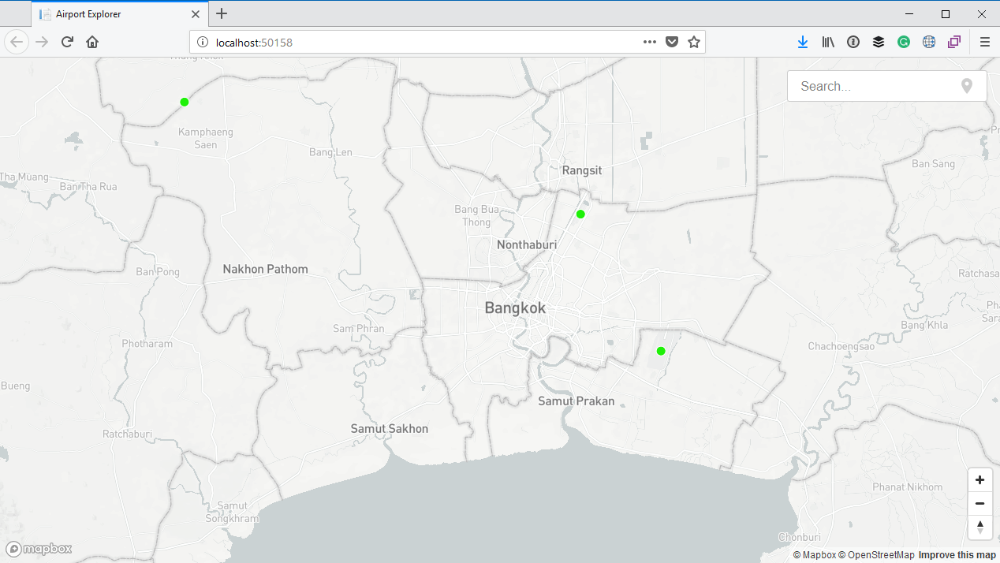
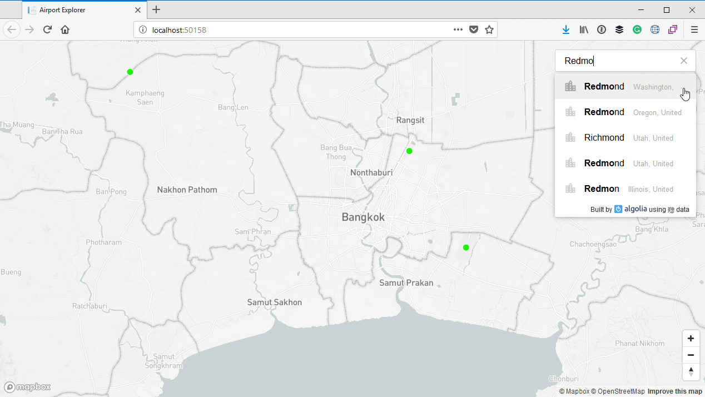
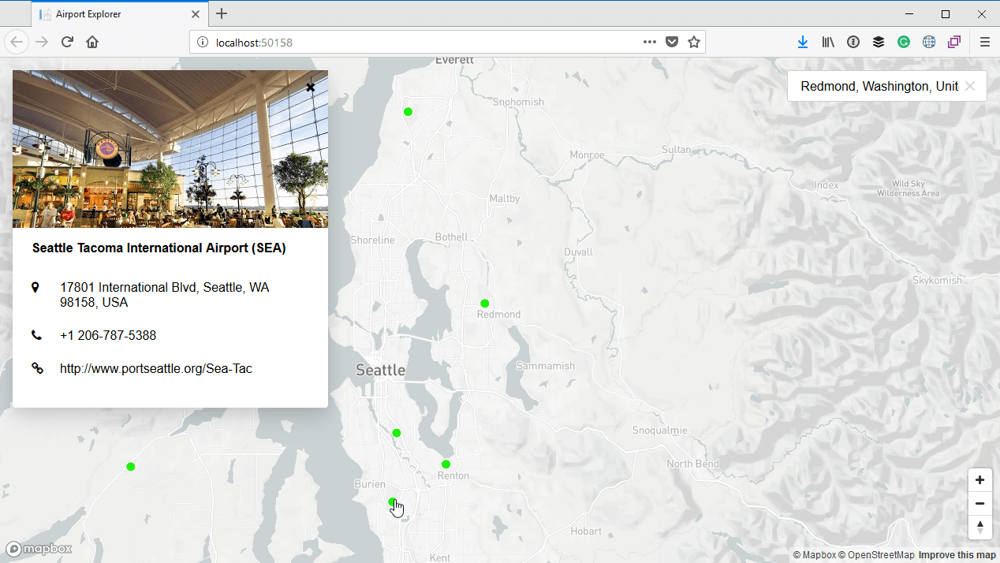

# Adding a place search box

It would also be nice to quickly search for and zoom to any city on the map. Currently this process is tedious as you can to manually pan and zoom the map. That is of course assuming you know you geography and know where the city you're looking for is on the map in the first place!

The people from [Algolia](https://www.algolia.com/) has kindly made a JavaScript component called [Algolia Places](https://community.algolia.com/places/) that allow us to quickly add place search.

It really is ridiculously easy to implement, so let's do that quickly.

Open your `Index.cshtml` file. First, below the existing map `div`, add a `div` and add Tailwind styling which will pin it to the top right corner of the page, with a little padding to the top and the right. Inside that, add an `input` which will ne the actual search box:

```html
<!-- Index.cshtml -->
<!-- Some markup omitted for brevity -->

<body>
<div id='map'></div>
    
<div class="absolute pin-t pin-r w-1/5 mt-4 mr-4">
    <input type="search" id="address-input" placeholder="Search..."/>
</div>

<!-- Some markup omitted for brevity -->

```

Now scroll down, and after `script` for the Mapbox library, add a script reference to `https://cdn.jsdelivr.net/npm/places.js@1.4.15`:

```html
<!-- Some markup omitted for brevity -->

<script src='https://api.mapbox.com/mapbox-gl-js/v0.42.0/mapbox-gl.js'></script>
<script src="https://cdn.jsdelivr.net/npm/places.js@1.4.15"></script>

<!-- Some markup omitted for brevity -->
```

Next, inside the big `script` block where all the other JavaScript we have written so far is located, you can add some script which will initialise the Algolia Places search component. We pass to it the `container` which is the id of the `textbox` we added earlier, and also set the `type` to `city` to limit the search to cities:

```js
var placesAutocomplete = places({
    container: document.querySelector('#address-input'),
    type: 'city'
});
```

Below that add another piece of script which will handle the `change` event of the Places component. All it will do is fly to the location of the place the user selected, and set the zoom level to 9:

```js
placesAutocomplete.on('change', e => {
    map.flyTo({
        center: [ e.suggestion.latlng.lng, e.suggestion.latlng.lat],
        zoom: 9
    });
});
```

## Testing it out

If I run my application again I will be centered to Bangkok as before, but notice the new search box in the top right corner:



Let's say I want to go visit the ASP.NET team, so let's search for Redmond:



If I select **Redmond, Washington** from the list it will automatically move the map to there. I can now click on the **Seattle Tacoma** airport to obtain more information:


