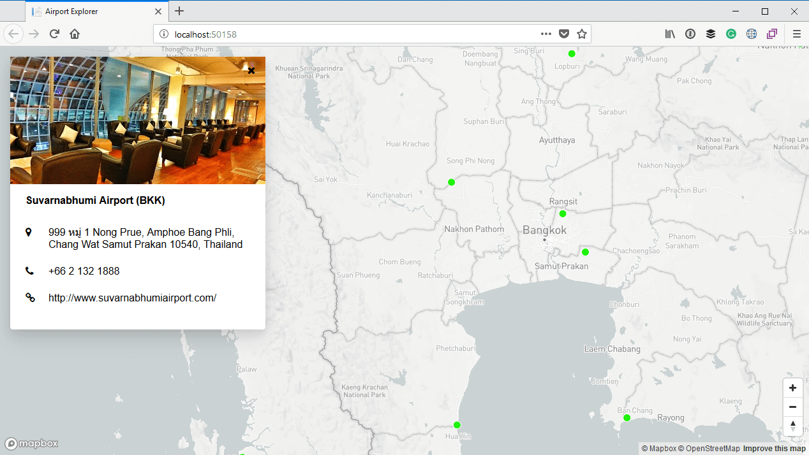

# Display the information in the info card

The final piece of the Google Places puzzle is to display the information in the info card. Let's update the markup for the info card as follows:

```html
<div id="info-card" class="absolute pin-t pin-l mt-4 ml-4 rounded shadow-lg bg-white" style="max-width: 400px; display: none;">
    <div class="overflow-hidden" style="height:200px;">
        <span class="absolute pin-t pin-r px-4 py-3">
            <i id="info-card-close-button" class="fa fa-times" role="button" aria-hidden="true"></i>
        </span>
        
    </div>
    <div class="px-6 py-4">
        <div id="airport-name" class="font-bold text-l">Airport Name goes here</div>
        
        <div id="more-info" class="mt-8">
            <div class="flex mb-4">
                <div class="w-10"><i class="fa fa-map-marker" aria-hidden="true"></i></div>
                <div id="airport-address" class="font-medium text-l mb-2 w-full"></div>
            </div>

            <div class="flex mb-4">
                <div class="w-10"><i class="fa fa-phone" aria-hidden="true"></i></div>
                <div id="airport-phone" class="font-medium text-l mb-2 w-full"></div>
            </div>

            <div class="flex mb-4">
                <div class="w-10"><i class="fa fa-link" aria-hidden="true"></i></div>
                <div id="airport-website" class="font-medium text-l mb-2 w-full"></div>
            </div>
        </div>
    </div>
</div>
```

The changes above was to add fields for the address, phone and website. These three elements are wrapped in an outer element which we can display and hide as required. We will hide it while the request to retrieve the information is executing. Once the result is returned, we will update the fields with the relevant values, and display that entire section. 

The markup also contains an update of the default URL for the image, so the placeholder image contains the text "Loading...", indicating we are loading the information. The `<div>` surrounding the image has also been updated to a fixed height of 200 pixels, and have a style set to hide overflow content. The reason for this is that we want the image to be exactly 400px * 200px. In some instance the image we retreive will be much taller than it is wide, and and then will have a lot of white space to the side of it.

If we set the overflow to be hidden, then the image will always fill the full width, but any part of the image which does not fit inside the 200px height will simply be clipped off. This means that in many case we will lose part of the image, but that is OK. The image is just meant to add a bit of nice styling to the info card. Nothing more.

Next let's update the event handler when the user clicks on the airport layer:

```js
map.on('click', 'airport', e => {
    var name = e.features[0].properties.name;
    var iataCode = e.features[0].properties.iataCode;
    var lat = e.features[0].geometry.coordinates[1];
    var lng = e.features[0].geometry.coordinates[0];

    // Display airport info
    document.querySelector('#airport-name').innerText = name + " (" + iataCode + ")";
    document.querySelector('#airport-image').src = 'http://via.placeholder.com/400x200?text=Loading...';

    // Hide more info at first
    document.querySelector('#more-info').style.display = 'none';

    // Ensure the info box is visible
    document.querySelector('#info-card').style.display = '';

    fetch(`/?handler=airportdetail&name=${name}&latitude=${lat}&longitude=${lng}`)
        .then(blob => blob.json())
        .then(data => {
            // Set airport properties
            if (data.photo)
                document.querySelector('#airport-image').src = 'data:image/png;base64,' + data.photo;
            else
                document.querySelector('#airport-image').src =
                    'http://via.placeholder.com/400x200?text=No+Image+Found';
            document.querySelector('#airport-address').innerText = data.formattedAddress || '-';
            document.querySelector('#airport-phone').innerText = data.phoneNumber || '-';
            document.querySelector('#airport-website').innerText = data.website || '-';

            // display more info
            document.querySelector('#more-info').style.display = '';
        })
        .catch(error => {
            document.querySelector('#airport-image').src = 'http://via.placeholder.com/400x200?text=Error+while+loading+data';
        });
});
```

First we have updated the code to also retrieve the latitude and longitude of the feature. Next, we set the name of the airport, and ensure the image is set to the "Loading..." placeholder image. We hide the `#more-info` section and display the info card.

This means that as soon as a user clicks on the airport, it will display the name of the airport and a "Loading..." placeholder image. All other information on the info card will be hidden for now, as the network request may take some time to execute.

Next we use the [JavaScript Fetch API](https://developer.mozilla.org/en-US/docs/Web/API/Fetch_API) to make a call to our `airportdetail` handler, passing along the `name`, `latitude` and `longitude`. When the request returns, we first convert it to JSON, and then we process it.

The processing part involves setting the airport image if there is one. If not, we change it to a "No Image Found" placeholder. Then we also update the address, phone and website fields, and finally we display the `#more-info` `div` so the address and other details are visible.

If any error occurs, we simply replace the placeholder image with one that reads "Error while loading data".

With that in place, all that is left is to run the applicaiton. Let's go to **Suvarnabhumi Airport** airport again, and click on it:



Excellent!