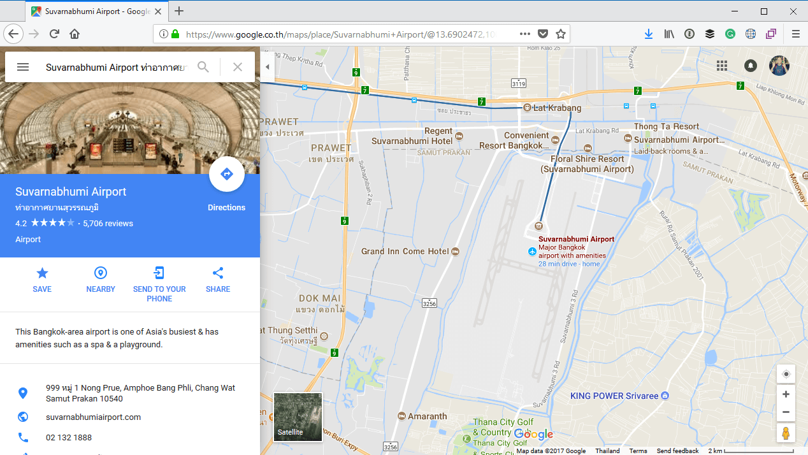
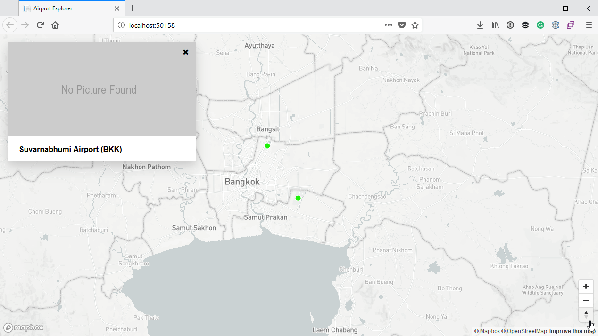

# Displaying an information card

We also want to allow a user to get more information about an airport. When they click on the marker for one of the airports, we will display an information card with more details about the airport. This will be very similar as to when you select an item on Google Maps, for example:



In this section we will only display the name and IATA code of the airport, but in the next section we will start augmenting this information from external sources.

## Tailwind CSS

We will be using [Tailwind CSS](https://tailwindcss.com/), which is a CSS utility framework that will allow us to add nice styling to the information cards. We will be referencing the Tailwind stylesheet directly from the Content Delivery Network, so add the following to the `<head>` section in your page:

```html
<link href="https://cdn.jsdelivr.net/npm/tailwindcss/dist/tailwind.min.css" rel="stylesheet">
```

We will also be using [Font Awesome](fontawesome.io/), so go ahead and include the stylesheet for that as well:

```html
<link rel="stylesheet" href="https://maxcdn.bootstrapcdn.com/font-awesome/4.7.0/css/font-awesome.min.css" />
```

The `<head>` section of your page should now look similar to this:

```html
<head>
    <meta charset='utf-8'/>
    <title>Airport Explorer</title>
    <meta name='viewport' content='initial-scale=1,maximum-scale=1,user-scalable=no'/>
    <link href='https://api.mapbox.com/mapbox-gl-js/v0.42.0/mapbox-gl.css' rel='stylesheet'/>
    <link href="https://cdn.jsdelivr.net/npm/tailwindcss/dist/tailwind.min.css" rel="stylesheet">
    <link rel="stylesheet" href="https://maxcdn.bootstrapcdn.com/font-awesome/4.7.0/css/font-awesome.min.css" />
    <style>
        body { margin:0; padding:0; }
        #map { position:absolute; top:0; bottom:0; width:100%; }
    </style>
</head>
```

## Adding the info card

We can now add markup for the info card to the page. Let's add it just below the `<div id='map'></div>` and before any of the `<script>` tags.

```html
<div id="info-card" class="absolute pin-t pin-l mt-4 ml-4 rounded shadow-lg bg-white" style="max-width: 400px; display: none;">
    <div>
        <span class="absolute pin-t pin-r px-4 py-3">
            <i id="info-card-close-button" class="fa fa-times" role="button" aria-hidden="true"></i>
        </span>
        
    </div>
    <div class="px-6 py-4">
        <div id="airport-name" class="font-bold text-l">Airport Name goes here</div>
    </div>
</div>
```

This creates an outer `div` with the id of `info-card`. We add some of the Tailwind classes to it which will pin it to the top left of the page, and a top and left margin of 4 `rem`, which will give it just a nice bit of spacing away from the edge of the page. It also has some inline styling to set it to a fixed width of 400 pixels wide, and to set the `display` to `none`, which will hide it. We will display it via JavaScript once the user clicks on an airport.

The info card also contains other markup which displays a close button and a placeholder image, as well as a placeholder where the airport name will go.

## Displaying the info card

To display the info card, we will handle the `click` event of the `airport` layer. Once again, inside the `load` handler add the following script:

```js
map.on('click', 'airport', e => {
    var name = e.features[0].properties.name;
    var iataCode = e.features[0].properties.iataCode;

    // Display airport info
    document.querySelector('#airport-name').innerText = name + " (" + iataCode + ")";

    // Ensure the info box is visible
    document.querySelector('#info-card').style.display = '';
});
```

This script will extract the name and IATA Code from the feature which was clicked. It will then set the name of the airport, and remove the `display: none;` style, which will display the info card.

Let's also update the previous snippet of code which created the `Popup` component to set `closeOnClick` to `true`. This will close the hover popup as soon as we click on the airport feature, which will then display the info card.

```js
var popup = new mapboxgl.Popup({
    closeButton: false,
    closeOnClick: true
});
```

## Handle the close button event

We will also need to handle the `click` event for the close button in the info card. Simply add the following snippet of code to your `<script>` block, somewhere outside `load` event handler:

```js
document.querySelector('#info-card-close-button').addEventListener('click', function(event) {
    document.querySelector('#info-card').style.display = 'none';
});
```

That will set the `display: none;` style again when the user clicks on the close button, causing the info card to be hidden again.

## Running the app

Let's run the app again. I'll zoom into Bangkok again and click on **Suvarnabhumi Airport**:



You can play around with it and select other airports if you want, and also try closing the info card by clicking on the close button in the info card.

## Full source code

This is what the full source code for the page looks like at this moment:

```html
@page
@model IndexModel

<!DOCTYPE html>
<html>
<head>
    <meta charset='utf-8'/>
    <title>Airport Explorer</title>
    <meta name='viewport' content='initial-scale=1,maximum-scale=1,user-scalable=no'/>
    <link href='https://api.mapbox.com/mapbox-gl-js/v0.42.0/mapbox-gl.css' rel='stylesheet'/>
    <link href="https://cdn.jsdelivr.net/npm/tailwindcss/dist/tailwind.min.css" rel="stylesheet">
    <link rel="stylesheet" href="https://maxcdn.bootstrapcdn.com/font-awesome/4.7.0/css/font-awesome.min.css" />
    <style>
        body { margin:0; padding:0; }
        #map { position:absolute; top:0; bottom:0; width:100%; }
    </style>
</head>
<body>
<div id='map'></div>

<div id="info-card" class="absolute pin-t pin-l mt-4 ml-4 rounded shadow-lg bg-white" style="max-width: 400px; display: none;">
    <div>
        <span class="absolute pin-t pin-r px-4 py-3">
            <i id="info-card-close-button" class="fa fa-times" role="button" aria-hidden="true"></i>
        </span>
        
    </div>
    <div class="px-6 py-4">
        <div id="airport-name" class="font-bold text-l">Airport Name goes here</div>
    </div>
</div>

<script src='https://api.mapbox.com/mapbox-gl-js/v0.42.0/mapbox-gl.js'></script>
<script>
    mapboxgl.accessToken = '@Model.MapboxAccessToken';
    var map = new mapboxgl.Map({
        container: 'map',
        style: 'mapbox://styles/mapbox/light-v9'
    });

    var nav = new mapboxgl.NavigationControl();
    map.addControl(nav, 'bottom-right');

    map.on('load', () => {
            map.addSource("airports",
                {
                    type: "geojson",
                    data: "?handler=airports",
                    cluster: true, // Enable clustering
                    clusterRadius: 50, // Radius of each cluster when clustering points
                    clusterMaxZoom: 6 // Max zoom to cluster points on
                });

            map.addLayer({
                id: 'clusters',
                type: 'circle',
                source: 'airports',
                filter: ['has', 'point_count'],
                paint: {
                    'circle-color': {
                        property: 'point_count',
                        type: 'interval',
                        stops: [
                            [0, '#41A337'],
                            [100, '#2D7026'],
                            [750, '#0B5703'],
                        ]
                    },
                    'circle-radius': {
                        property: 'point_count',
                        type: 'interval',
                        stops: [
                            [0, 20],
                            [100, 30],
                            [750, 40]
                        ]
                    }
                }
            });

            map.addLayer({
                id: 'cluster-count',
                type: 'symbol',
                source: 'airports',
                filter: ['has', 'point_count'],
                layout: {
                    'text-field': '{point_count}',
                    'text-font': ['DIN Offc Pro Medium', 'Arial Unicode MS Bold'],
                    'text-size': 12
                }
            });

            map.addLayer({
                id: 'airport',
                type: 'circle',
                source: 'airports',
                filter: ['!has', 'point_count'],
                paint: {
                    'circle-color': '#1EF008',
                    'circle-radius': 6,
                    'circle-stroke-width': 1,
                    'circle-stroke-color': '#fff'
                }
            });

            // Create a popup, but don't add it to the map yet.
            var popup = new mapboxgl.Popup({
                closeButton: false,
                closeOnClick: true
            });

            map.on('mouseenter', 'airport', function(e) {
                // Change the cursor style as a UI indicator.
                map.getCanvas().style.cursor = 'pointer';

                // Populate the popup and set its coordinates
                // based on the feature found.
                popup.setLngLat(e.features[0].geometry.coordinates)
                    .setHTML(e.features[0].properties.name)
                    .addTo(map);
            });

            map.on('mouseleave', 'airport', function() {
                map.getCanvas().style.cursor = '';
                popup.remove();
            });

            map.on('click', 'airport', e => {
                var name = e.features[0].properties.name;
                var iataCode = e.features[0].properties.iataCode;

                // Display airport info
                document.querySelector('#airport-name').innerText = name + " (" + iataCode + ")";

                // Ensure the info box is visible
                document.querySelector('#info-card').style.display = '';
            });
        });

    document.querySelector('#info-card-close-button').addEventListener('click', function(event) {
        document.querySelector('#info-card').style.display = 'none';
    });
</script>
</body>
</html>
```