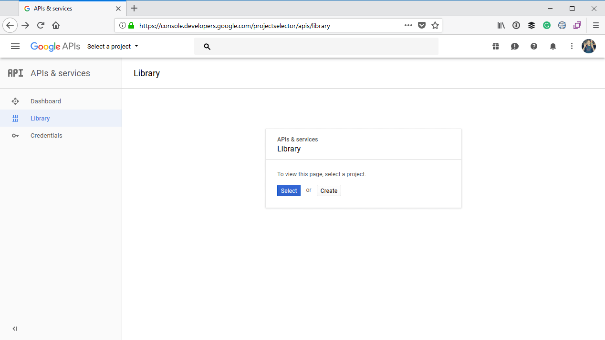
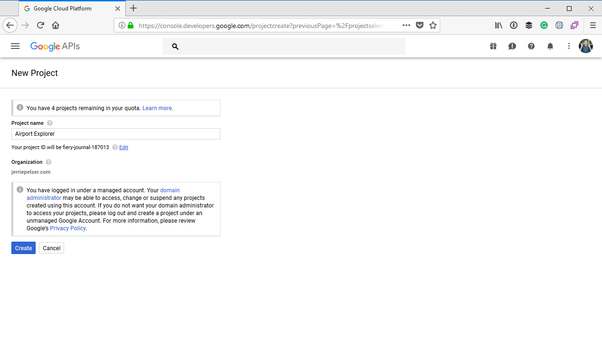
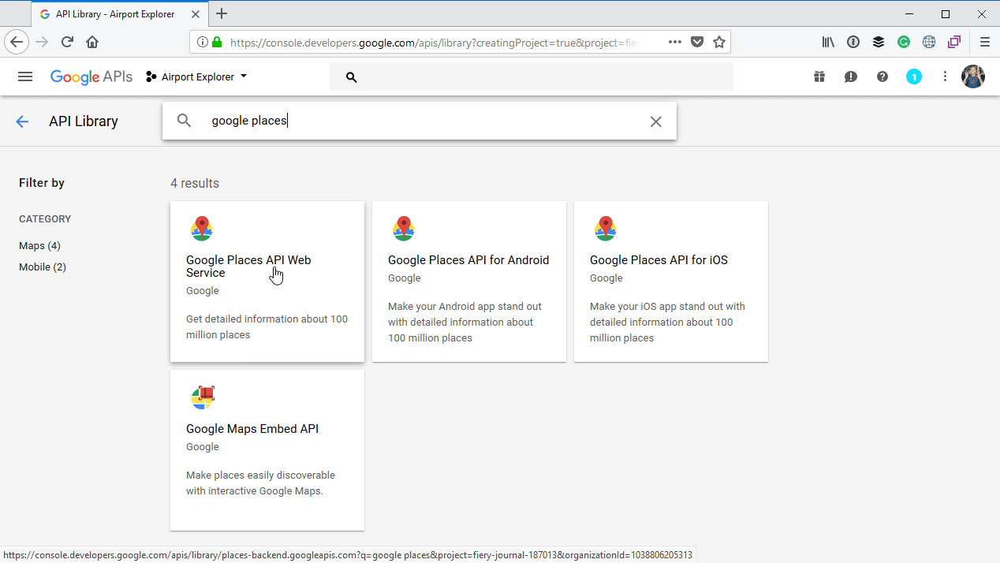
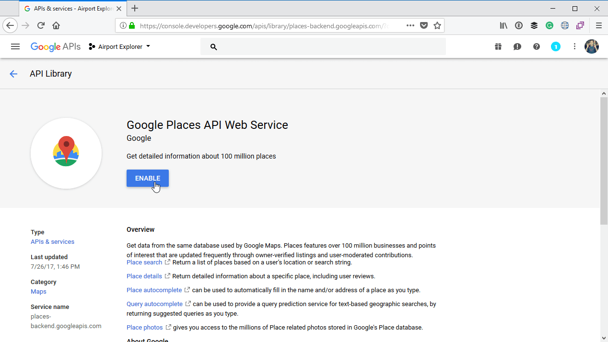
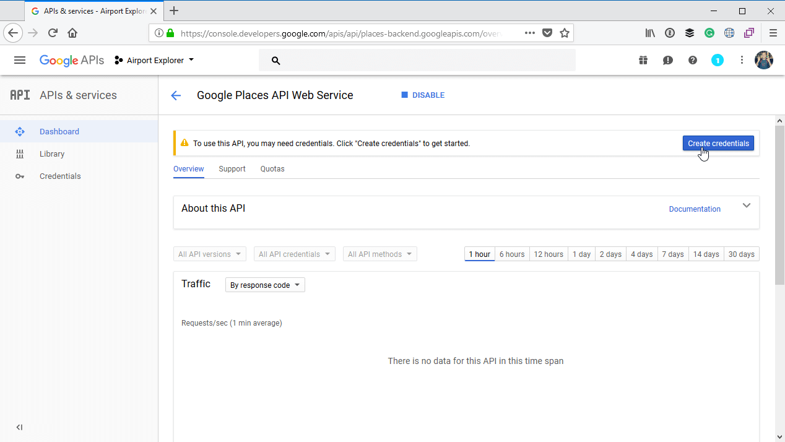
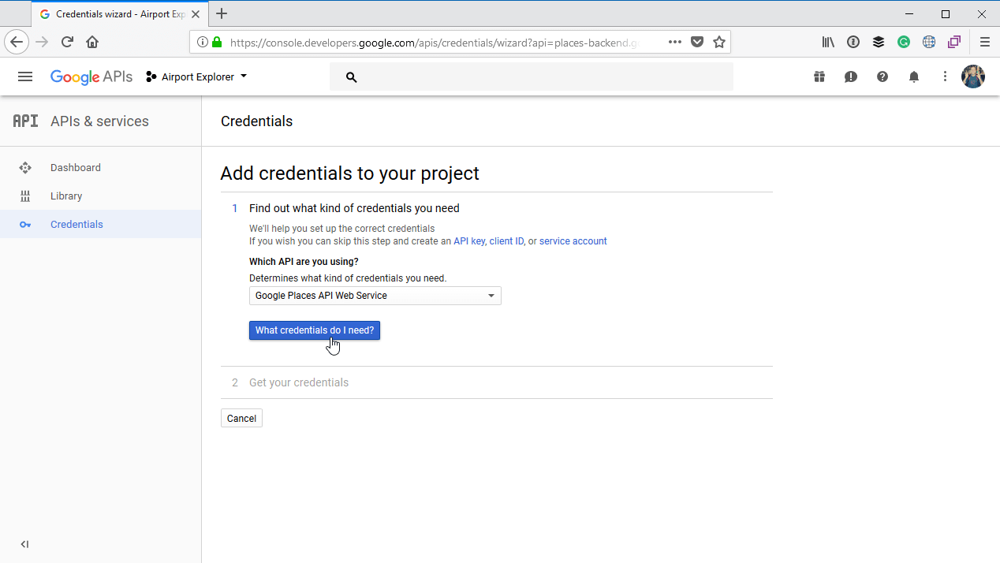
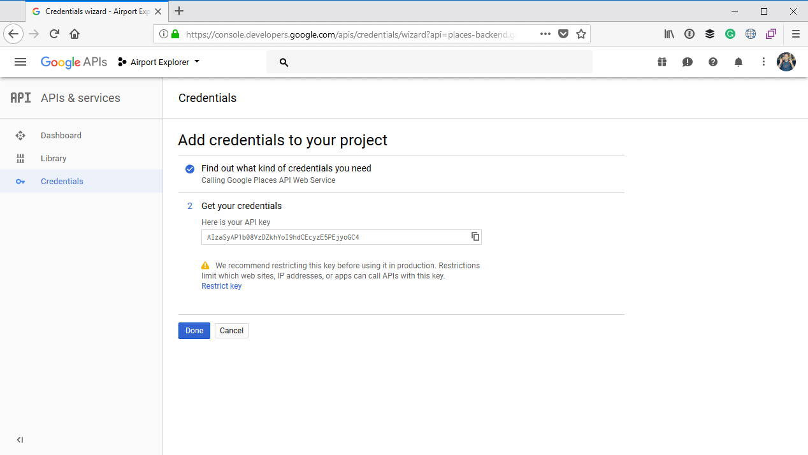

# Augment the airport information

The information we are currently displaying about an airport is limited to the airport name and IATA code. As you have seen when we designed the info card, we left a placeholder to place an image of the airport. We can also add more information about each airport such as the address, phone number, website address, etc.

To get this information we will be using the [Google Places API](https://developers.google.com/places/). 

Ensure that you have signed into your Google account and head over to https://console.developers.google.com/projectselector/apis/library. Click on the button to **Create** a project.

Give the project a name of **Airport Explorer** and then click on **Create**:

Once the project has been created, search for **google places**, and then click to select **Google Places API Web Service**:

Next, click on the button to **Enable** this service:

Once the service is enabled, click on **Create Credentials**:

Click on **What credentials do I need?**:

This will create an **API Key** for you. Copy that API key, as you will need it to call the Google Places API. Finally you can click on the **Done** button.

