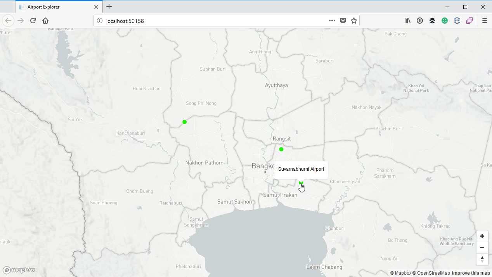

# Displaying airport information on hover

Currently we indicate the various airports on the map, but a user has no way to get more information about a particular airport. The first thing we will do is to provide a tooltip when a user hover over a particular airport marker.

Thankfully the MapBox SDK comes to our rescue again, and supplies us with a [popup component](https://www.mapbox.com/mapbox-gl-js/api#popup) we can use. Inside the `load` handler we created before, after you have added the data source and layers, declare a new instance of this component:

```js
map.on('load', () => {
        // Code which adds the data source and layers have been 
        // omitted for the sake of brevity...

        // Create a popup, but don't add it to the map yet.
        var popup = new mapboxgl.Popup({
            closeButton: false,
            closeOnClick: false
        });
    });
```

Next, we will need to display the popup. We can do this by handling the `mouseenter` event for the `airport` layer. This event will fire every time the mouse enters inside the bounds of one of the features on this layer. In other words, every time we move our mouse over one of the small green circles indicating an airport on the map, this event will fire.

Information about the feature will be passed in the event arguments. We can then simply use the feature's coordinates to indicate where the popup should be displayed, and also retrieve the name of the airport from the feature's properties we added before when we returned the feature collection.

We can also handle the `mouseleave` event for the layer, which will fire every time the mouse leaves the bounds of one of the features on this layer. In this instance we will remove the popup from the map.

```js
map.on('load', () => {
        // Code which adds the data source and layers have been 
        // omitted for the sake of brevity...
        
        // Create a popup, but don't add it to the map yet.
        var popup = new mapboxgl.Popup({
            closeButton: false,
            closeOnClick: false
        });

        map.on('mouseenter', 'airport', function(e) {
            // Change the cursor style as a UI indicator.
            map.getCanvas().style.cursor = 'pointer';

            // Populate the popup and set its coordinates
            // based on the feature found.
            popup.setLngLat(e.features[0].geometry.coordinates)
                .setHTML(e.features[0].properties.name)
                .addTo(map);
        });

        map.on('mouseleave', 'airport', function() {
            map.getCanvas().style.cursor = '';
            popup.remove();
        });
    });
```

Run the application again, and zoom to a point where you can see some of the airport markers. Hover the mouse over the airport and you will see the name of the airport displayed inside a popup window:

