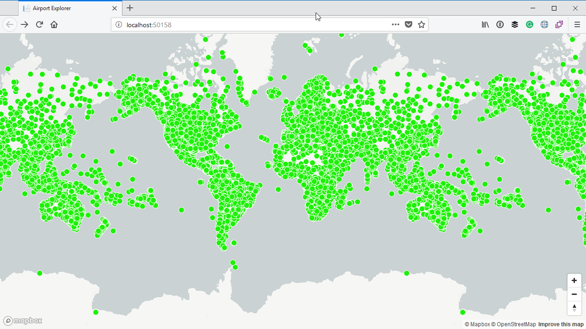
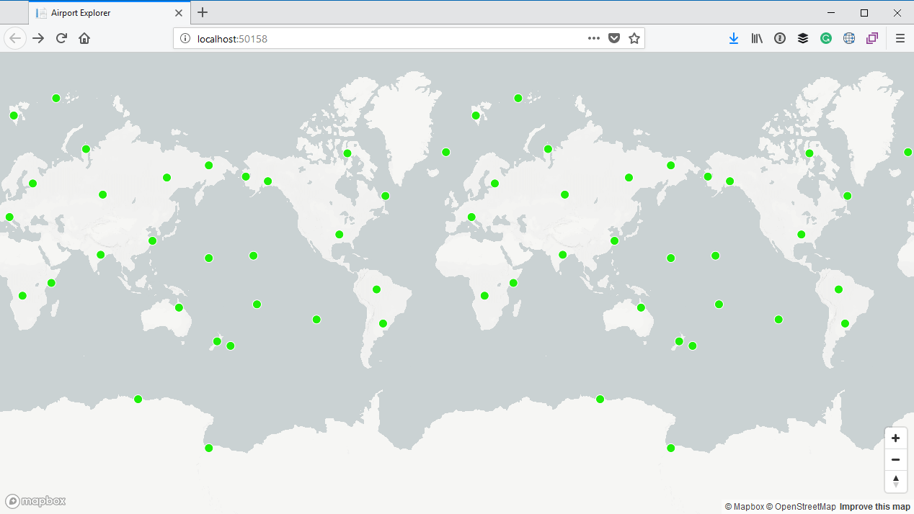
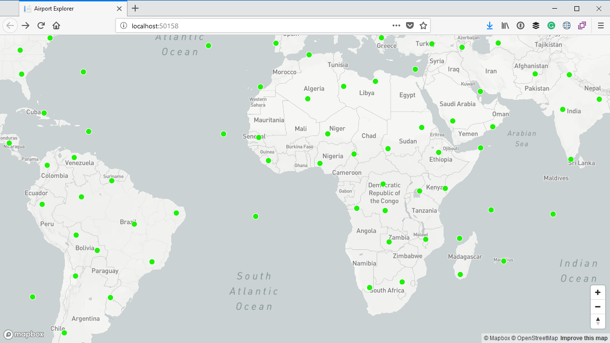
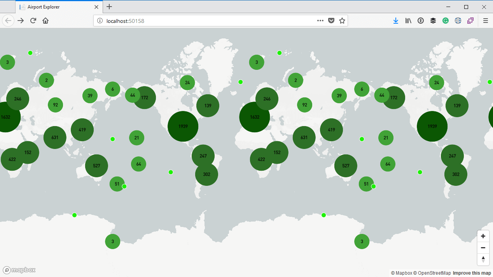
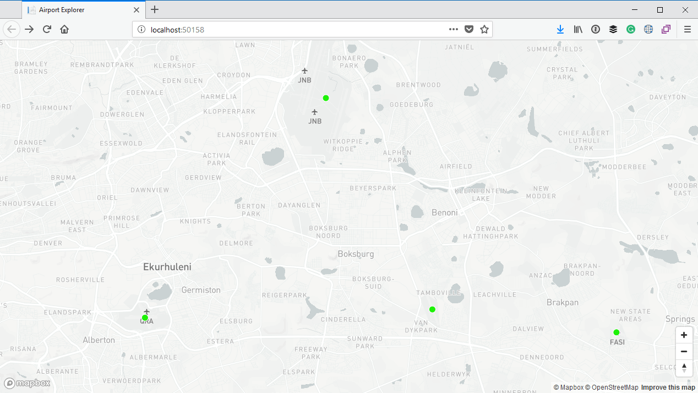

# Clustering data with Mapbox

It is great that we finally are making progress and have visual feedback of that progress, but damn! That is a lot of information being displayed on the map and it does not really look very good.



Thankfully Mapbox provides a way to manage large sets of data, namely [Clustering](https://www.mapbox.com/mapbox-gl-js/example/cluster/). What clustering does is that it groups features (or points) on the map into a single feature (or point) based on the geographical vicinity of those features.

To enable clustering we can set the `cluster` property of our data source to `true`. We can also specify the radius of each cluster via the `clusterRadius` property. In our case we will specify the default value which is `50`. 

Finally we can specify the maximum zoom level at which clustering is enabled by making use of the `clusterMaxZoom` property. For example, if we specify a value of `6` this means that clusering will only be enabled up until zoom level 6. If we zoom in further past that level, clustering will not be enabled anymore. 

So let us update the call to the `addSource` function as follows:

```js
map.addSource("airports",
    {
        type: "geojson",
        data: "?handler=airports",
        cluster: true, // Enable clustering
        clusterRadius: 50, // Radius of each cluster when clustering points
        clusterMaxZoom: 6 // Max zoom to cluster points on
    });
```

You can read more about these properties in the [Mapbox GeoJson data source documentation](https://www.mapbox.com/mapbox-gl-js/style-spec/#sources-geojson). Depending on the amount of points you have on your map, and the density of those points you may want to play around with the `clusterMaxZoom` and `clusterRadius`. I have played around with these values, and I think for the data set we are working with, these values are good.

When we run our application again, you can see that we only see a very few data points on the map:



If we zoom in, you will see that more data points appear:



## Differentiate between clusters and individual points

The problem is that some of these points are clusters, and some of them are actual airports. It would be good to differentiate between the two. We can do this by adding another layer to the map.

We will give this layer an `id` of `clusters`, a `type` of `circle` and also link it to the `airports` data source. The `paint` property is a complex structure which specifies intervals of circle color and circle radius based on the number of points in a cluster. The more points in the cluster, the darker the color and larger the radius.

Another thing we want to do is that we only want to have items which are actual clusters to be visibile. If a feature (or item on the layer) is a cluster, it will have a `point_count` property. We can use the `filter` property to specifies a condition that only features with a `point_count` property will be displayed:

```js
map.addLayer({
    id: 'clusters',
    type: 'circle',
    source: 'airports',
    filter: ['has', 'point_count'],
    paint: {
        'circle-color': {
            property: 'point_count',
            type: 'interval',
            stops: [
                [0, '#41A337'],
                [100, '#2D7026'],
                [750, '#0B5703'],
            ]
        },
        'circle-radius': {
            property: 'point_count',
            type: 'interval',
            stops: [
                [0, 20],
                [100, 30],
                [750, 40]
            ]
        }
    }
});
```

We will also want to add the inverse condition to our original `airport` layer by specifying that only features which do not have a `point_count` property will be displayed.

```js
map.addLayer({
    id: 'airport',
    type: 'circle',
    source: 'airports',
    filter: ['!has', 'point_count'],
    paint: {
        'circle-color': '#1EF008',
        'circle-radius': 6,
        'circle-stroke-width': 1,
        'circle-stroke-color': '#fff'
    }
});
```

The effect of this will be that when items are clustered, only the bigger circles in the `clusters` layer will be displayed. Conversely, if the ietms are not clustered, then the `cluster` layer will be hidden and only the individual features (or points) denoting an airport will be displayed.

Lets also add another layer which will display the actual number of points in a cluster. Same as with the cluster layer itself, this will only be displayed when there are actual points in the cluster:

```js
map.addLayer({
    id: 'cluster-count',
    type: 'symbol',
    source: 'airports',
    filter: ['has', 'point_count'],
    layout: {
        'text-field': '{point_count}',
        'text-font': ['DIN Offc Pro Medium', 'Arial Unicode MS Bold'],
        'text-size': 12
    }
});
```

Let's run the application again. This time we can see something very different:



We don't have the mess we had before. Go ahead and zoom into any area of the map.

In the screenshot below I zoomed in to the Johannesburg area of South Africa. You can see the points on the map indicating airports, and if you look closely you can see the actual airport on the map itself:



## The source code so far

For reference, this is what the source code for our page looks like so far:

```html
@page
@model IndexModel

<!DOCTYPE html>
<html>
<head>
    <meta charset='utf-8'/>
    <title>Airport Explorer</title>
    <meta name='viewport' content='initial-scale=1,maximum-scale=1,user-scalable=no'/>
    <link href='https://api.mapbox.com/mapbox-gl-js/v0.42.0/mapbox-gl.css' rel='stylesheet'/>
    <style>
        body { margin:0; padding:0; }
        #map { position:absolute; top:0; bottom:0; width:100%; }
    </style>
</head>
<body>
<div id='map'></div>

<script src='https://api.mapbox.com/mapbox-gl-js/v0.42.0/mapbox-gl.js'></script>
<script>
    mapboxgl.accessToken = '@Model.MapboxAccessToken';
    var map = new mapboxgl.Map({
        container: 'map',
        style: 'mapbox://styles/mapbox/light-v9'
    });

    var nav = new mapboxgl.NavigationControl();
    map.addControl(nav, 'bottom-right');

    map.on('load',
        () => {
            map.addSource("airports",
                {
                    type: "geojson",
                    data: "?handler=airports",
                    cluster: true, // Enable clustering
                    clusterRadius: 50, // Radius of each cluster when clustering points
                    clusterMaxZoom: 6 // Max zoom to cluster points on
                });

            map.addLayer({
                id: 'clusters',
                type: 'circle',
                source: 'airports',
                paint: {
                    'circle-color': {
                        property: 'point_count',
                        type: 'interval',
                        stops: [
                            [0, '#41A337'],
                            [100, '#2D7026'],
                            [750, '#0B5703'],
                        ]
                    },
                    'circle-radius': {
                        property: 'point_count',
                        type: 'interval',
                        stops: [
                            [0, 20],
                            [100, 30],
                            [750, 40]
                        ]
                    }
                }
            });

            map.addLayer({
                id: 'cluster-count',
                type: 'symbol',
                source: 'airports',
                filter: ['has', 'point_count'],
                layout: {
                    'text-field': '{point_count}',
                    'text-font': ['DIN Offc Pro Medium', 'Arial Unicode MS Bold'],
                    'text-size': 12
                }
            });

            map.addLayer({
                id: 'airport',
                type: 'circle',
                source: 'airports',
                filter: ['!has', 'point_count'],
                paint: {
                    'circle-color': '#1EF008',
                    'circle-radius': 6,
                    'circle-stroke-width': 1,
                    'circle-stroke-color': '#fff'
                }
            });
        });
</script>
</body>
</html>
```