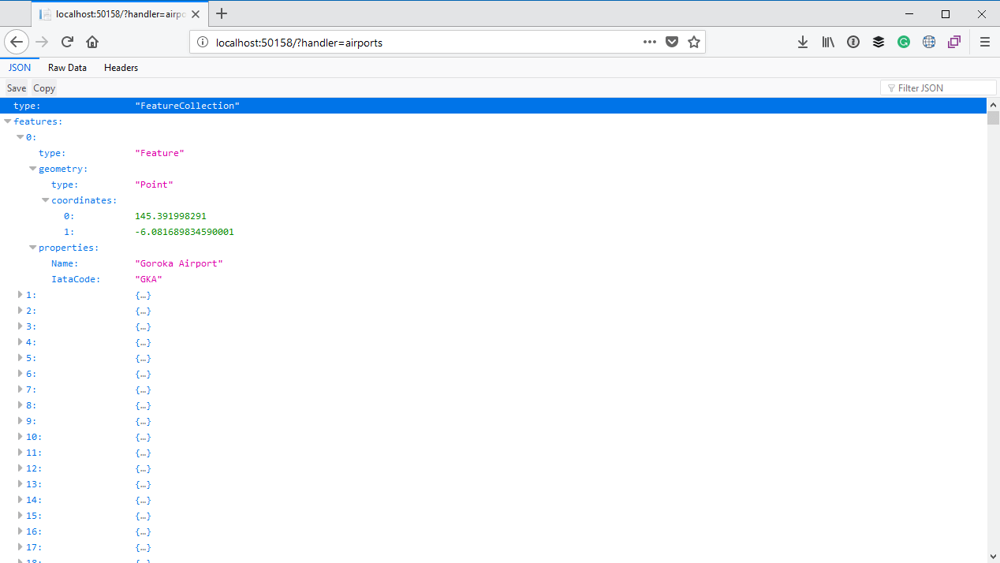
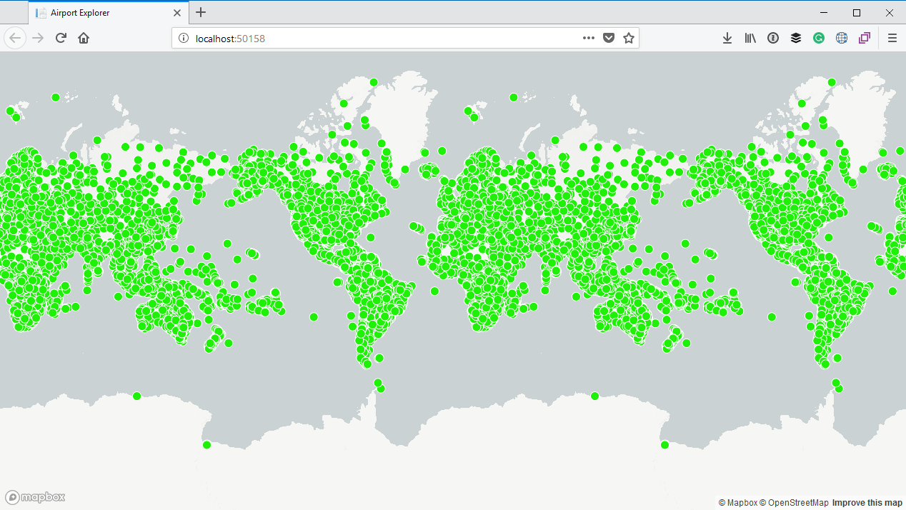

# Displaying the airports on the map

In this section we will look at how to display the airports on the map. 

The basic principle is that we can define a **data source** which supplies the data to be displayed on the map. There are various [different kinds of sources](https://www.mapbox.com/mapbox-gl-js/style-spec/#sources) we can specify, one of which is a [GeoJson](http://geojson.org/) source. After we have defined a data source we will need to add a **[layer](https://www.mapbox.com/mapbox-gl-js/style-spec/#layers)** to the map. The layer is the visual representation of the data obtained from the data source.

## Defining a Razor Page handler

We will define a Razor Page **handler** which will return the information in GeoJson format to be displayed on the map. We already have one handler defined in our page model:

```csharp
// Index.cshtml.cs

public class IndexModel : PageModel
{
    public string MapboxAccessToken { get; }

    public IndexModel(IConfiguration configuration)
    {
        MapboxAccessToken = configuration["Mapbox:AccessToken"];
    }

    public void OnGet()
    {

    }
}
```

See that `OnGet` method? That is a Razor Page handler and it will be invoked whenever an HTTP GET request is made to the page. Handlers follow the convention of `On<HTTP Method>` or `On<HTTP Method>Async` for asynchronous and synchronous methods respectively. So a handler called `OnGet` or `OnGetAsync` will repspond to HTTP GET requests. A handler called `OnPost` or `OnPostAsync` will respond to an HTTP POST request.

We can also create our own custom handlers and then invoke them by adding a `handler` query string parameter to the request. So for example, if we had the following handler:

```csharp
public IActionResult OnGetAirports()
{

}
```

Assuming our website is hosted at `http://localhost:50158/`, we can invoke it by making the following HTTP GET request:

```text
http://localhost:50158/?handler=airports
```

So go ahead and create a new handler on the `IndexModel` class, and call it `OnGetAirports`. For now you can just return `null`. Also be sure to import the `Microsoft.AspNetCore.Mvc` namespace which contains the `IActionResult` interface.

```csharp
public IActionResult OnGetAirports()
{
    return null;
}
```

## Reading data from the CSV file

The information we downloaded before is contained in comma-separated values (CSV) format. When returning the list of airports we will read it directly from the CSV file. We can use a NuGet package called [CsvHelper](https://www.nuget.org/packages/CsvHelper/) to assist us with reading the information from the file. Go ahead and install that NuGet package:

```
Install-Package CsvHelper
```

We will also need to get the path to the file located in the `wwwroot` folder. In order to do that we can inject an instance of `IHostingEnvironment` into our Razor Page class and then use the [WebRootPath property](https://docs.microsoft.com/en-us/dotnet/api/microsoft.aspnetcore.hosting.ihostingenvironment.webrootpath?view=aspnetcore-2.0) to get the physical location of the `wwwroot` folder:

```csharp
public class IndexModel : PageModel
{
    private readonly IHostingEnvironment _hostingEnvironment;
    public string MapboxAccessToken { get; }

    public IndexModel(IConfiguration configuration, IHostingEnvironment hostingEnvironment)
    {
        _hostingEnvironment = hostingEnvironment;

        MapboxAccessToken = configuration["Mapbox:AccessToken"];
    }

    // some code omitted for brevity...
}
```

We can now open the `airports.dat` file using the `StreamReader` class and pass the stream to the constructor of the `CsvReader` class. We can then use the `CsvReader.Read()` method to read and iterate through the records of the CSV file. We can use the `CsvReader.GetField<T>()` method to read the values for a particular record.

In particular we are interested in the **Name**, **IATA Code**, **Latitude** and **Longitude** fields which are columns at index 1, 4, 6 and 7 of the CSV file respectively (the first column is at index 0 so the second column, which is the Name column, is therefore at index 1):

```csharp
public IActionResult OnGetAirports()
{
    using (var sr = new StreamReader(Path.Combine(_hostingEnvironment.WebRootPath, "airports.dat")))
    using (var reader = new CsvReader(sr))
    {
        while (reader.Read())
        {
            string name = reader.GetField<string>(1);
            string iataCode = reader.GetField<string>(4);
            double latitude = reader.GetField<double>(6);
            double longitude = reader.GetField<double>(7);
        }
    }

    return null;
}
```

### Handling CSV parsing issues

There is one tiny little problem, and that is that the `airports.dat` file escapes CSV string values incorrectly. According to [RFC 4180](https://tools.ietf.org/html/rfc4180) this is how escaping of double quotes should be handled:

> If double-quotes are used to enclose fields, then a double-quote appearing inside a field must be escaped by preceding it with another double quote.

So in other words, if the name of an airport is `Magdeburg "City" Airport`, it should be escaped as follows:

```
332,"Magdeburg ""City"" Airport","Magdeburg","Germany",\N,"EDBM",52.073612,11.626389,259,1,"E","Europe/Berlin","airport","OurAirports"
```

But the file we downloaded does not do that. Instead it escapes double quotes using the `\` character, for example:

```
332,"Magdeburg \"City\" Airport","Magdeburg","Germany",\N,"EDBM",52.073612,11.626389,259,1,"E","Europe/Berlin","airport","OurAirports"
```

The `CsvHelper` library also has no way for us to specify a different escape character (although there is an [open issue for this](https://github.com/JoshClose/CsvHelper/issues/834)). For now we need to specify a custom `Configuration` instance and specify a `BadDataFound` handler. We do not need to do anything with the bad data, but as long as we specify a handler, CsvHelper will call the handler instead of throwing an exception. This will allow us to "silently" suppress any parsing errors.

Unfortunately this means that any record (or row) containing an error will not be processed at all. Even though we will "lose" some records because of this, it is more acceptable than having exceptions thrown and the parsing of the entire file being aborted. 

Of course you can also go and manually clean up the file we downloaded to correct any wrongly escaped double quotes and thus ensuring that the entire file be processed correctly. If this was a production system we were writing, then that would be the preferable course of action to take. But, since this is a little demo app we are writing, we are not going to worry about it too much.

For now we will suppress parsing errors by updating the code as follows:

```csharp
public IActionResult OnGetAirports()
{
    var configuration = new Configuration
    {
        BadDataFound = context =>
        {
        }
    };

    using (var sr = new StreamReader(Path.Combine(_hostingEnvironment.WebRootPath, "airports.dat")))
    using (var reader = new CsvReader(sr, configuration))
    {
        // Some code omitted for brevity...
    }

    return null;
}
```

## Constructing the GeoJSON

Now that we are processing the data from the CSV file correctly we can construct the GeoJson which Mapbox requires. Yet again there is a NuGet package which can help us with this, so go ahead and install it:

```
Install-Package GeoJSON.Net
```

We will create a `FeatureCollection` instance and then for each of the records in the CSV file add a new `Feature` instance to the collection. Each `Feature` instance will contain a `Point` with the coordinates of the airport, as well second parameter which is a dictionary with extra properties we want to add. In our case we can add the **Name** and **IATA code** of the airport. Finally, we can return a JSON payload containing the collection.

```csharp
public IActionResult OnGetAirports()
{
    var configuration = new Configuration
    {
        BadDataFound = context => { }
    };

    using (var sr = new StreamReader(Path.Combine(_hostingEnvironment.WebRootPath, "airports.dat")))
    using (var reader = new CsvReader(sr, configuration))
    {
        FeatureCollection featureCollection = new FeatureCollection();

        while (reader.Read())
        {
            string name = reader.GetField<string>(1);
            string iataCode = reader.GetField<string>(4);
            double latitude = reader.GetField<double>(6);
            double longitude = reader.GetField<double>(7);

            featureCollection.Features.Add(new Feature(
                new Point(new Position(latitude, longitude)),
                new Dictionary<string, object>
                {
                    {"name", name},
                    {"iataCode", iataCode}
                }));
        }

        return new JsonResult(featureCollection);
    }
}
```

Let's run our application again and in the browser and pass the `handler=airports` query string:



As you can see from the screenshot above, our application returns JSON with all the the airports. BTW, I am using Firefox which allows me to view the JSON in a nice treeview as demonstrated in the screenshot above.

## Displaying the aiports on the map

The final piece of the puzzle is to display the airports on the map. Head back to the `Index.cshtml` file and in the script block where we created the `map`, you can specify a `load` event handler. As per the [Mapbox documentation for the load event](https://www.mapbox.com/mapbox-gl-js/api/#map.event:load):

> Fired immediately after all necessary resources have been downloaded and the first visually complete rendering of the map has occurred.

```js
map.on('load',() => {
    // Code to be executed after the map has loaded
    });
```

So at this point we know that our map is displayed and we can start adding our data to it. Inside the code for the load event we will first make a call to `addSource` which will add a data source to the map. We will name the data source `airports`, specify a type of `geojson` and specify a URL in the `data` field which will make a call to `?handler=airports` - and therefore execute our custom Razor Page handler:

```js
map.addSource("airports",
{
    type: "geojson",
    data: "?handler=airports"
});
```

Next we need to add a layer to the map. We can give the layer an `id` of `airport`, specify that it will be a `circle` and that the datasource for the layer is the `airports` data source which we just created. We also specify some styling properties for each circle such as the color, radius, etc:

```js
map.addLayer({
    id: 'airport',
    type: 'circle',
    source: 'airports',
    paint: {
        'circle-color': '#1EF008',
        'circle-radius': 6,
        'circle-stroke-width': 1,
        'circle-stroke-color': '#fff'
    }
});
```

This is what the full final markup for our page looks like:

```html
@page
@model IndexModel

<!DOCTYPE html>
<html>
<head>
    <meta charset='utf-8'/>
    <title>Airport Explorer</title>
    <meta name='viewport' content='initial-scale=1,maximum-scale=1,user-scalable=no'/>
    <link href='https://api.mapbox.com/mapbox-gl-js/v0.42.0/mapbox-gl.css' rel='stylesheet'/>
    <style>
        body { margin:0; padding:0; }
        #map { position:absolute; top:0; bottom:0; width:100%; }
    </style>
</head>
<body>
<div id='map'></div>

<script src='https://api.mapbox.com/mapbox-gl-js/v0.42.0/mapbox-gl.js'></script>
<script>
    mapboxgl.accessToken = '@Model.MapboxAccessToken';
    var map = new mapboxgl.Map({
        container: 'map',
        style: 'mapbox://styles/mapbox/light-v9'
    });

    map.on('load',
        () => {
            map.addSource("airports",
                {
                    type: "geojson",
                    data: "?handler=airports"
                });

            map.addLayer({
                id: 'airport',
                type: 'circle',
                source: 'airports',
                filter: ['!has', 'point_count'],
                paint: {
                    'circle-color': '#1EF008',
                    'circle-radius': 6,
                    'circle-stroke-width': 1,
                    'circle-stroke-color': '#fff'
                }
            });
        });
</script>
</body>
</html>
```

It is time to compile and run the application again. This time you should see a bunch of circles being displayed on the map, each of which represents an individual airport:



## Mapbox Terminology

Before we finish off this section, I just want to cover the Mapbox terminology again as I will use this terminology a lot moving forward. 

First off, we have a **data source** - in our case a **GeoJson** data source which returns a list of airports. More specifically, it returns a **collection of features**. In other words each feature represents an airport. It contains the coordinates of the feature, as well as some extra properties we specified. In our case the extra properties were the name and IATA code of each airport.

Next we have a layer. The layer is linked to a data source. When we added the layer we specified that the layer will draw little green circles which represents each of the features from the data source. So in other words, each of those green circles on the map represents an airport.

> Read more
>
> * Read about [sources in the Mapbox documentation](https://www.mapbox.com/mapbox-gl-js/style-spec/#sources)
> * Read about [layers in the Mapbox documentation](https://www.mapbox.com/mapbox-gl-js/style-spec/#layers)
> * The [GeoJson Specification](http://geojson.org/)