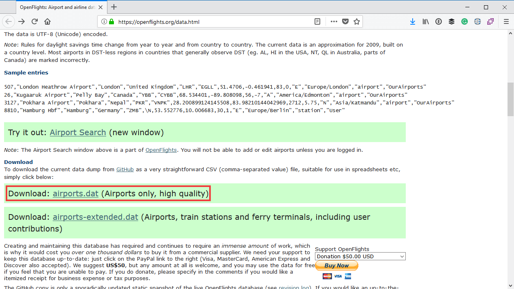
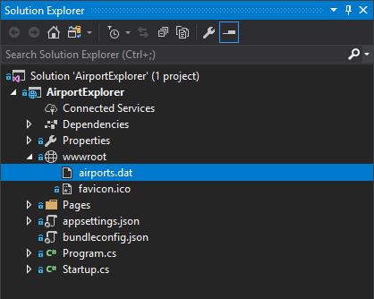

# Downloading the list of airports

Go to https://openflights.org/data.html and scroll down the page a bit until you see the link to the `airports.dat` download:



Download this file in your web browser, and copy it to the `wwwroot` folder of your project:



If you open it in Visual Studio, you will notice that the file contains a comma-separated list of values:

```text
1,"Goroka Airport","Goroka","Papua New Guinea","GKA","AYGA",-6.081689834590001,145.391998291,5282,10,"U","Pacific/Port_Moresby","airport","OurAirports"
2,"Madang Airport","Madang","Papua New Guinea","MAG","AYMD",-5.20707988739,145.789001465,20,10,"U","Pacific/Port_Moresby","airport","OurAirports"
3,"Mount Hagen Kagamuga Airport","Mount Hagen","Papua New Guinea","HGU","AYMH",-5.826789855957031,144.29600524902344,5388,10,"U","Pacific/Port_Moresby","airport",
"OurAirports"
4,....
```

The specification of this file (taken from the OpenFlights website) is as follows:

Field | Description
----------|---------
**Airport ID** 	| Unique OpenFlights identifier for this airport.
**Name** | Name of airport. May or may not contain the City name.
**City** | Main city served by airport. May be spelled differently from Name.
**Country** | Country or territory where airport is located. See countries.dat to cross-reference to ISO 3166-1 codes.
**IATA** | 3-letter IATA code. Null if not assigned/unknown.
**ICAO** | 4-letter ICAO code. Null if not assigned.
**Latitude** | Decimal degrees, usually to six significant digits. Negative is South, positive is North.
**Longitude** | Decimal degrees, usually to six significant digits. Negative is West, positive is East.
**Altitude** | In feet.
**Timezone** | Hours offset from UTC. Fractional hours are expressed as decimals, eg. India is 5.5.
**DST** | Daylight savings time. One of E (Europe), A (US/Canada), S (South America), O (Australia), Z (New Zealand), N (None) or U (Unknown). See also: Help: Time
**Tz database time zone** | Timezone in "tz" (Olson) format, eg. "America/Los_Angeles".
**Type** | Type of the airport. Value "airport" for air terminals, "station" for train stations, "port" for ferry terminals and "unknown" if not known. In airports.csv, only type=airport is included.
**Source** | Source of this data. "OurAirports" for data sourced from OurAirports, "Legacy" for old data not matched to OurAirports (mostly DAFIF), "User" for unverified user contributions. In airports.csv, only source=OurAirports is included.

We will work with this next when we take a quick look at how to display information on a Mapbox map.