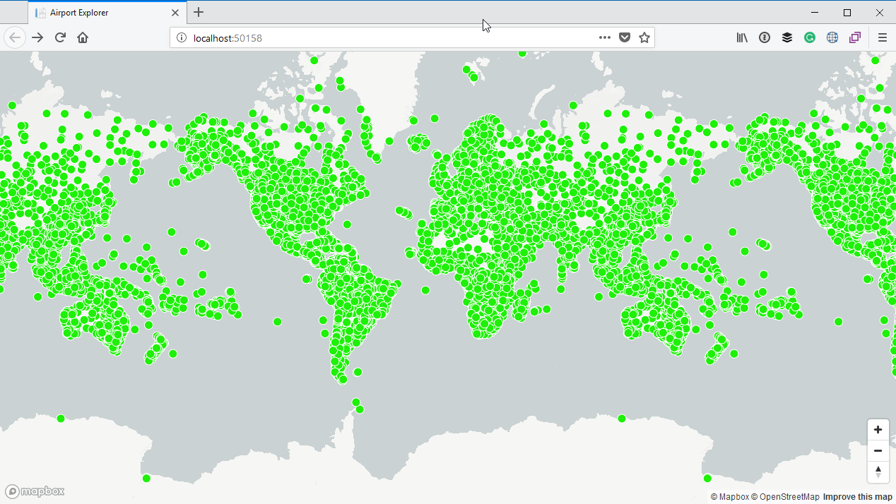

# Adding navigation controls

As some of you may have noticed, there is no obvious way to zoom in and out of the map. If you have a mouse with a track wheel, you can zoom in and use using the wheel. If you have a trackpad, you can also zoom in and out by swiping down or up with two fingers on the trackpad.

It would however be more usable if there are buttons on the map which allows the user to zoom in and out. This is very easy to accomplish by creating a new `NavigationControl`. We can then call the `addControl` function of the map to add the control, specifying the location where it should be placed. In our case we will add it to the bottom right of the map:

```js
mapboxgl.accessToken = '@Model.MapboxAccessToken';
var map = new mapboxgl.Map({
    container: 'map',
    style: 'mapbox://styles/mapbox/light-v9'
});

var nav = new mapboxgl.NavigationControl();
map.addControl(nav, 'bottom-right');

map.on('load', () => {
        // Some code omitted for brevity...
    });
```

When you run the application you can see the zoom controls in the bottom-right corner:

